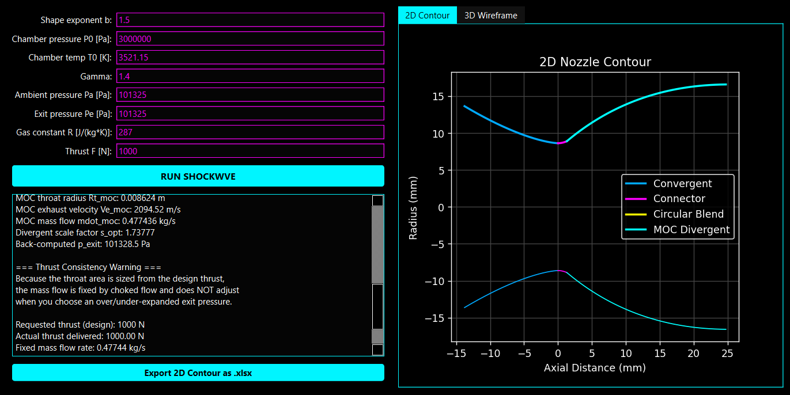
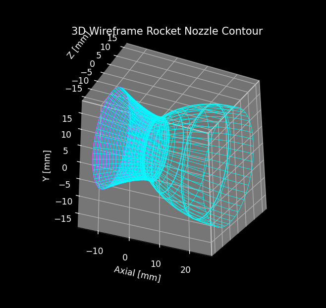

<p align="center">
  
</p>

<h1 align="center">⚡ SHOCKWVE — Nozzle Designer ⚡</h1>

<p align="center">
  <strong>isentropic nozzle generator & 3D visualizer</strong><br>
  <strong>Version 1.0 — © 2025 Jason Da Silva</strong>
</p>

---

## 🚀 Overview
**SHOCKWVE** is a neon-styled nozzle design tool that generates:
- Convergent–divergent nozzle geometry  
- Rao throat blending  
- Full MOC bell nozzle contours  
- 2D plots + 3D wireframe revolutions  
- Thrust predictions for perfect, under, or over-expanded conditions  
- ASCII cyber-splash intro  
- Professional Windows installer included  

This tool is intended for **educational + preliminary design** using ideal compressible-flow assumptions.

---

## 🔥 Features
- ⚡ **Neon cyber UI**  
- ⚙️ **Isentropic flow model (γ constant)**  
- 🚀 **Automatic throat sizing from thrust**  
- 📉 **Under / Perfect / Over-expanded thrust output**  
- 🌀 **3D nozzle wireframe generator**  
- 🟦 **Full installer with shortcuts + license + README**  
- 💾 **Exports 2D contour points to Excel ready for simulation(.xlsx)**  

---

## 📥 Download
### ⬇️ **[Download SHOCKWVE Installer (Latest Release)](../../releases/latest/download/SHOCKWVE_Installer.exe)**

This installer includes:
- SHOCKWVE.exe  
- Shortcuts  
- Dependencies  
- README + License  

---
---

## 📸 Screenshots

### 🔷 Main Interface
<p align="center">
  
</p>

### 🔷 3D Nozzle Visualization
<p align="center">
  
</p>

---


## 🧪 Inputs & Model Assumptions

| Input | Description |
|------|-------------|
| **F (N)** | Required thrust at design condition |
| **Pe (Pa)** | Desired exit pressure |
| **P₀ (Pa)** | Chamber pressure |
| **T₀ (K)** | Chamber temperature |
| **γ** | Specific heat ratio (constant) |
| **R (J/kg·K)** | Gas constant |

### Physics Model
- 1-D, steady, **isentropic** flow  
- **γ constant** through the entire nozzle  
- **Choked throat** → mass flow fixed  
- No viscous losses, no shocks  
- Off-design operation alters thrust automatically  

---

## ⚠️ Limitations
> SHOCKWVE is **not** a tool ment for final design decisions but serves as a preliminary tool for CFD simulations.  
> It is based on ideal compressible-flow theory and should not be used for mission-critical hardware decisions.

---

## 🛠️ Building from Source
Install dependencies:

```bash
pip install pyqt6 matplotlib numpy openpyxl
